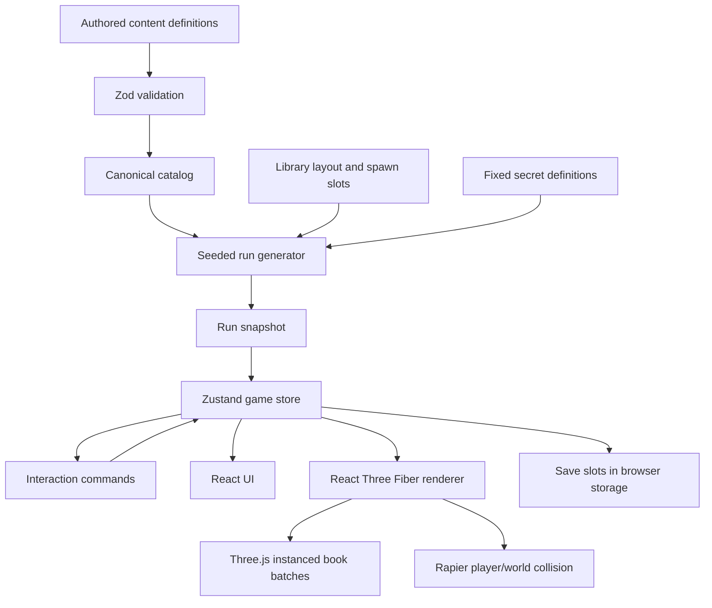

# Implementation Plan: Feature-Complete Librarian Gameplay Clone

## Goal

Reproduce the complete gameplay system of *Librarian: Tidy Up the Arcane Library!* as a browser game that statically exports from Next.js to GitHub Pages.

The clone must support the full two-floor library, 31 sections, 400 book series, 3,072 physical volumes, randomized ordinary-book placement, fixed secrets, carrying and stack management, shelf validation, progression, Major Magic, Minor Magic, Recall Stone, save/load, Cozy mode, completion evaluation, challenge conditions, and Special Stage behavior.

Use original implementation code and original visual/audio assets. Do not copy extracted proprietary source code, models, textures, UI artwork, or audio from the source game.

Implementation proceeds in vertical slices, but each slice must use the final architecture rather than temporary mechanics.

## Current state

**Current:** The repository is a Next.js 16 App Router static-export application.

**Current:** `next.config.ts` exports the application for the GitHub Pages project path `/librarian-game`.

**Current:** `src/game/catalog/sections.ts` contains the 31 known library sections.

**Current:** `src/game/catalog/schema.ts` contains minimal section and book-series schemas.

**Current:** `src/game/state/game-state.ts` contains a placeholder runtime-state interface.

**Current:** The GitHub Actions build passes dependency installation, TypeScript, ESLint, and `next build`. Pages configuration fails because the repository Pages publishing source has not yet been enabled as GitHub Actions.

**Current:** The repository is being migrated from npm to pnpm 12.

## Target design

Keep authored game definitions, generated run state, mutable save state, and renderer state separate.



### Runtime ownership

React owns menus, HUD, settings, save-slot UI, and coarse game-state subscriptions.

Zustand owns authoritative browser game state and game actions.

React Three Fiber owns scene composition.

Three.js owns high-frequency transforms and instanced rendering.

Rapier owns player/world collision. Ordinary scattered books are not individual dynamic rigid bodies. Their transforms are authoritative game data and are rendered in instanced batches. Dropping a stack writes deterministic transforms instead of simulating thousands of free rigid bodies.

### Rendering rule for 3,072 books

Group visible books by compatible geometry/material family and render them through `InstancedMesh` or the React Three Fiber instancing equivalent. Do not create 3,072 independent React mesh components.

When one book is carried, inspected, animated, or otherwise needs individual interaction, temporarily render that book outside its static instance batch. Return it to the batch when the interaction finishes.

### Book identity

A book series is authored once. Individual physical volumes are derived.

```ts
export interface BookSeriesDefinition {
  id: string;
  sectionCode: SectionCode;
  title: string;
  volumeCount: 3 | 5 | 10;
  visualFamily: string;
}

export interface BookInstance {
  id: string;
  seriesId: string;
  volumeNumber: number;
}
```

For example, a ten-volume series creates ten stable IDs:

```text
monsterology-world-dragons:01
monsterology-world-dragons:02
...
monsterology-world-dragons:10
```

Never author 3,072 independent book records.

### Seeded run generation

A new game stores a seed. The seed deterministically shuffles ordinary volume IDs across legal book spawn slots.

Fixed secrets do not use the ordinary-book shuffle.

Given the same catalog version, layout version, and seed, the generator must reproduce the same initial placement.

```ts
export interface RunIdentity {
  seed: string;
  catalogVersion: number;
  layoutVersion: number;
}
```

### Shelf validation

A row is correct only when:

1. all volumes of one series are on the same row,
2. no foreign volume occupies the validated series span,
3. volumes are ordered left-to-right by `volumeNumber`,
4. the row belongs to the series' section.

The exact shelf tier inside the correct section remains flexible.

Row validation is derived from shelf contents. Do not store a second mutable `isCorrect` flag that can drift from placement state.

### Save representation

Persist semantic state, not renderer internals.

Persist:

- run identity,
- elapsed time,
- Cozy mode,
- player transform,
- book locations,
- carried order,
- progression,
- unlocked Major Magic,
- Major Magic upgrades/cooldowns if active,
- collected keys,
- Minor Magic upgrades,
- Recall Stone state,
- completion/evaluation state,
- settings.

Do not persist Three.js object IDs, Rapier handles, instanced-mesh indices, React component state, or derived row correctness.

## File map

| Action | Path | Symbols | Purpose |
|---|---|---|---|
| Modify | `package.json` | `packageManager`, dependencies | Standardize pnpm and add the 3D/state runtime. |
| Create | `pnpm-lock.yaml` | lockfile | Make dependency installation deterministic. |
| Modify | `.github/workflows/deploy-pages.yml` | build job | Use pnpm with a frozen lockfile. |
| Delete | `.github/workflows/bootstrap-pnpm-lock.yml` | temporary workflow | Remove the one-time lockfile bootstrap after it commits the lockfile. |
| Modify | `src/game/catalog/schema.ts` | catalog schemas | Define canonical content contracts. |
| Create | `src/game/catalog/book-series.ts` | `bookSeries` | Hold the 400 canonical series definitions. |
| Modify | `src/game/catalog/sections.ts` | `sections` | Add stable visual/layout metadata without changing source-game category semantics. |
| Create | `src/game/content/abilities.ts` | `majorMagicDefinitions`, `minorMagicDefinitions` | Define progression abilities. |
| Create | `src/game/content/secrets.ts` | `secretDefinitions` | Define the four fixed hidden keys/chests. |
| Create | `src/game/parity/features.ts` | `featureParity` | Track source-game parity explicitly. |
| Create | `src/game/layout/schema.ts` | layout schemas | Define floors, colliders, shelves, rows, spawn slots, and fixed locations. |
| Create | `src/game/layout/library-layout.ts` | `libraryLayout` | Define the complete two-floor semantic layout. |
| Create | `src/game/run/seeded-random.ts` | `createSeededRandom` | Provide deterministic randomization. |
| Create | `src/game/run/types.ts` | run-state types | Define book instances and semantic locations. |
| Create | `src/game/run/generate-run.ts` | `generateInitialRun` | Generate all 3,072 initial book placements. |
| Replace | `src/game/state/game-state.ts` | `GameState` | Expand authoritative game state. |
| Create | `src/game/state/game-store.ts` | `useGameStore` | Implement actions and persistence boundary. |
| Create | `src/game/rules/row-validation.ts` | `getRowValidation` | Derive completed rows. |
| Create | `src/game/rules/progression.ts` | progression functions | Derive magic progression and unlocks. |
| Create | `src/game/render/GameShell.tsx` | `GameShell` | Own client-only game surface and HUD. |
| Create | `src/game/render/GameCanvas.tsx` | `GameCanvas` | Create the R3F/Rapier scene. |
| Create | `src/game/render/PlayerController.tsx` | `PlayerController` | Implement first-person movement and pointer lock. |
| Create | `src/game/render/LibraryScene.tsx` | `LibraryScene` | Render architecture, shelves, and fixed props. |
| Create | `src/game/render/BookInstances.tsx` | `BookInstances` | Batch-render ordinary books. |
| Create | `src/game/interaction/interaction-controller.ts` | interaction commands | Handle inspect, pickup, reorder, drop, and shelf placement. |
| Create | `src/game/save/schema.ts` | save schemas | Version and validate imported/persisted saves. |
| Create | `src/game/save/storage.ts` | save-slot functions | Implement manual slots and autosave. |
| Modify | `src/app/page.tsx` | `Home` | Mount the game shell. |

## Implementation steps

### 1. Standardize pnpm and retain a green static build

**Files**

- `Modify: package.json`
- `Create: pnpm-lock.yaml`
- `Modify: .github/workflows/deploy-pages.yml`
- `Delete: .github/workflows/bootstrap-pnpm-lock.yml`

**Changes**

- Pin pnpm in `packageManager`.
- Use pnpm in all documented commands and CI.
- Install with `--frozen-lockfile` after the first lockfile is committed.
- Keep `next build` as the static export command.
- Do not add a server runtime.

**Code shape**

```yaml
- uses: pnpm/setup@v3
  with:
    runtime: node@22
    cache: true
    require-lockfile: true

- run: pnpm typecheck
- run: pnpm lint
- run: pnpm build
```

**Validation**

- Run `pnpm typecheck`.
- Run `pnpm lint`.
- Run `pnpm build`.
- Confirm `out/index.html` exists.
- Confirm GitHub Actions reaches `Configure GitHub Pages`. A failure there is a repository Pages setting failure, not an application build failure.

### 2. Establish the complete canonical content contracts

**Files**

- `Modify: src/game/catalog/schema.ts`
- `Create: src/game/catalog/book-series.ts`
- `Create: src/game/content/abilities.ts`
- `Create: src/game/content/secrets.ts`
- `Create: src/game/parity/features.ts`

**Changes**

- Represent all 31 sections and all 400 series as validated build-time definitions.
- Generate 3,072 volume instances from the series definitions.
- Record visual families as clues, not categorical truth.
- Define all five Major Magic abilities.
- Define all four Minor Magic rewards.
- Define the four fixed key locations and their matching rewards.
- Track unsupported and partially matched source features explicitly.

**Code shape**

```ts
export const VolumeCountSchema = z.union([
  z.literal(3),
  z.literal(5),
  z.literal(10),
]);

export const BookSeriesSchema = z.object({
  id: z.string().regex(/^[a-z0-9-]+$/),
  sectionCode: SectionCodeSchema,
  title: z.string().min(1),
  volumeCount: VolumeCountSchema,
  visualFamily: z.string().min(1),
});

export const bookSeries = BookSeriesSchema.array().length(400).parse(bookSeriesData);

export const totalVolumeCount = bookSeries.reduce(
  (sum, series) => sum + series.volumeCount,
  0,
);

if (totalVolumeCount !== 3072) {
  throw new Error(`Expected 3072 volumes, got ${totalVolumeCount}`);
}
```

**Validation**

- Importing the catalog succeeds only at exactly 400 series and 3,072 volumes.
- Duplicate series IDs fail during build.
- Every series references an existing section.

### 3. Define semantic library geometry before visual detail

**Files**

- `Create: src/game/layout/schema.ts`
- `Create: src/game/layout/library-layout.ts`

**Changes**

- Model two floors.
- Model 31 section regions.
- Model every shelf and row as stable semantic IDs.
- Model legal ordinary-book spawn slots separately from shelf rows.
- Model fixed locations for keys, chests, Recall Stone, stair maps, and exit/evaluation interaction.
- Keep transforms data-driven so visual dimensions can be tuned without changing game rules.

**Code shape**

```ts
export interface Transform3 {
  position: readonly [number, number, number];
  rotation: readonly [number, number, number];
}

export interface ShelfRowDefinition {
  id: string;
  sectionCode: SectionCode;
  transform: Transform3;
  width: number;
  capacity: number;
}

export interface SpawnSlotDefinition {
  id: string;
  transform: Transform3;
  kind: "floor" | "table" | "bench" | "shelf-pile";
}
```

**Validation**

- Section codes are unique.
- Shelf-row IDs are unique.
- Spawn-slot IDs are unique.
- Ordinary spawn capacity is at least 3,072.
- Every fixed secret location exists in the layout.

### 4. Generate deterministic full-library runs

**Files**

- `Create: src/game/run/seeded-random.ts`
- `Create: src/game/run/types.ts`
- `Create: src/game/run/generate-run.ts`

**Changes**

- Derive individual volumes from the 400 series.
- Shuffle volumes deterministically using the run seed.
- Assign every volume to one legal ordinary spawn slot.
- Do not randomize secret locations.
- Make generated output independent of render order.

**Code shape**

```ts
export type BookLocation =
  | { kind: "spawn"; slotId: string }
  | { kind: "carried"; index: number }
  | { kind: "shelf"; rowId: string; index: number }
  | { kind: "dropped"; transform: Transform3 };

export interface RunBookState {
  bookId: string;
  location: BookLocation;
}
```

**Validation**

- Same seed produces byte-equivalent initial semantic placement.
- Different seeds alter ordinary-book placement.
- Every volume appears exactly once.
- No spawn slot contains more books than its authored capacity.

### 5. Replace placeholder state with action-based game state

**Files**

- `Replace: src/game/state/game-state.ts`
- `Create: src/game/state/game-store.ts`

**Changes**

- Store semantic book locations and carried order.
- Expose explicit actions for new game, pickup, reorder, drop, shelf placement, ability use, key collection, and settings.
- Keep high-frequency camera transforms outside Zustand.
- Store player transform only at save/checkpoint cadence.

**Code shape**

```ts
export interface GameActions {
  startNewGame(seed?: string): void;
  pickUpBook(bookId: string): void;
  moveCarriedBook(fromIndex: number, toIndex: number): void;
  dropCarriedBooks(): void;
  placeBookOnShelf(bookId: string, rowId: string, index: number): void;
}
```

**Validation**

- Carry capacity starts at 10.
- Capacity upgrades reach 13 and then 15.
- An action cannot duplicate or lose a book.
- Failed boundary validation leaves state unchanged.

### 6. Render the first-person library with final runtime technology

**Files**

- `Create: src/game/render/GameShell.tsx`
- `Create: src/game/render/GameCanvas.tsx`
- `Create: src/game/render/PlayerController.tsx`
- `Create: src/game/render/LibraryScene.tsx`
- `Modify: src/app/page.tsx`

**Changes**

- Mount a client-only R3F canvas.
- Use pointer lock for mouse look.
- Use Rapier for the player capsule and fixed architecture collision.
- Implement walk immediately.
- Unlock sprint and high jump through Minor Magic state rather than separate controllers.
- Keep HUD outside the WebGL canvas.

**Validation**

- Click-to-lock mouse works.
- Escape releases pointer lock.
- WASD movement respects floor and shelf collision.
- Static export still succeeds.

### 7. Batch-render all ordinary books

**Files**

- `Create: src/game/render/BookInstances.tsx`

**Changes**

- Share geometry.
- Batch by material/visual family.
- Apply per-instance position, rotation, scale, and color.
- Maintain instance-to-book lookup for raycast interaction.
- Temporarily exclude carried/animated books from static batches.

**Validation**

- 3,072 books render without 3,072 React mesh components.
- Raycasting resolves a rendered instance to the stable `bookId`.
- Moving one book updates only affected batches.

### 8. Implement the complete manual handling loop

**Files**

- `Create: src/game/interaction/interaction-controller.ts`
- `Create: src/game/rules/row-validation.ts`

**Changes**

- Inspect the targeted book.
- Pick up into the carried stack.
- Reorder carried books.
- Drop one book.
- Hold drop to place the entire carried stack neatly.
- Place books onto shelf rows.
- Validate series ordering and section correctness after shelf changes.
- Emit row-completion feedback from derived validation transitions.

**Validation**

- A correct series validates only in numerical order.
- A split series does not validate.
- A series in the wrong category does not validate.
- Reordering the same row immediately updates validation.

### 9. Implement progression and all Major Magic

**Files**

- `Create: src/game/rules/progression.ts`
- `Modify: src/game/state/game-store.ts`
- `Create: src/game/content/abilities.ts`

**Changes**

Implement:

1. Sort.
2. Shelf Guide.
3. Insight.
4. Auto-Shelving.
5. Assemble.

Model cooldowns and upgrades as data. Keep exact cooldown values isolated so source-parity tuning does not change action logic.

**Validation**

- Correct rows advance progression.
- Every ability has a deterministic target set.
- Assemble never exceeds carry capacity.
- Auto-Shelving respects section and ordering rules.
- A no-Major-Magic run remains possible.

### 10. Implement fixed secrets and Minor Magic

**Files**

- `Create: src/game/content/secrets.ts`
- `Modify: src/game/layout/library-layout.ts`
- `Modify: src/game/state/game-store.ts`

**Changes**

Implement the four fixed keys and matching upgrades:

- Crimson Octagon → High Jump.
- Golden Diamond → Carry Capacity +3.
- Emerald Club → Sprint.
- Azure Star → Carry Capacity +2.

Keep the Emerald-note interaction as authored world content.

**Validation**

- Each key exists at one fixed layout location.
- Each reward can be acquired once.
- Azure access is traversal-gated by the authored geometry.
- Carry capacity progresses 10 → 13 → 15.

### 11. Implement saves, autosave, Recall Stone, and recovery behavior

**Files**

- `Create: src/game/save/schema.ts`
- `Create: src/game/save/storage.ts`
- `Modify: src/game/state/game-store.ts`

**Changes**

- Support multiple manual save slots.
- Support autosave toggle.
- Version every save payload.
- Validate saves with Zod before mutating live state.
- Implement Recall Stone availability and recovery behavior for remaining unshelved/unreachable books.
- Reject malformed or incompatible saves without partially applying them.

**Validation**

- Save/load reproduces semantic state.
- Corrupt save data does not change current state.
- Recall Stone cannot duplicate books.
- Reloading a completed row preserves its correctness through derived state.

### 12. Implement time modes, evaluation, endings, and challenge conditions

**Files**

- `Create: src/game/rules/evaluation.ts`
- `Create: src/game/rules/challenges.ts`
- `Modify: src/game/state/game-store.ts`

**Changes**

- Normal mode tracks visible elapsed time and lighting progression.
- Cozy mode hides/stops visible time presentation and lighting-time progression according to source behavior.
- Track Major Magic usage independently from Minor Magic.
- Support sub-three-hour completion.
- Support no-Major-Magic completion.
- Support the all-books-shelved/zero-correct-rows failure route.
- Model Principal evaluation from recorded run facts.
- Do not hard-code an overall score that loses the underlying factors.

**Validation**

- Challenge state is derived from run history.
- Minor Magic does not invalidate the no-Major-Magic condition.
- One accidentally validated row invalidates the zero-correct-row route.
- Completion requires all 3,072 volumes handled according to the target ending condition.

### 13. Implement Special Stage and automation payoff

**Files**

- `Create: src/game/modes/special-stage.ts`
- `Modify: src/game/state/game-store.ts`
- `Modify: src/game/render/GameShell.tsx`

**Changes**

- Unlock Special Stage after main completion.
- Implement its ultimate auto-clear behavior.
- Keep Special Stage timing separate from normal clear-time records.

**Validation**

- A fresh profile cannot enter Special Stage.
- A completed profile can.
- Ultimate completion does not overwrite the best normal-run timing incorrectly.

### 14. Close visual, audio, control, and settings parity

**Files**

- `Create: src/game/settings/schema.ts`
- `Create: src/game/audio/audio-manager.ts`
- `Modify: src/game/render/GameCanvas.tsx`
- `Modify: src/game/render/PlayerController.tsx`

**Changes**

Support equivalent controls/settings where they matter to browser play:

- rebindable actions,
- mouse sensitivity,
- invert mouse,
- head bobbing,
- FOV,
- render scale,
- motion blur when implemented,
- vignette,
- VSync-equivalent browser presentation where controllable,
- tutorial display,
- autosave,
- audio volume groups,
- controller mapping.

Implement evolving environmental feedback:

- row completion light/audio,
- section completion state,
- decreasing visible clutter,
- changing ambience as the library becomes organized.

**Validation**

- Settings survive reload.
- Motion-sickness-related settings can disable their effects.
- Input mappings do not conflict silently.

## Edge cases and failure behavior

- Reject a catalog build unless it has exactly 400 series and 3,072 derived volumes.
- Reject duplicate book IDs, series IDs, section codes, shelf-row IDs, and spawn-slot IDs.
- Never let a failed pickup, drop, placement, or ability action remove a book from all locations.
- Never let one book occupy two semantic locations.
- Never derive game rules from current Three.js instance indices because batching may reorder instances.
- Recompute instanced bounds after changing instance transforms when required for correct raycasting/culling.
- Keep fixed secrets out of seeded ordinary placement.
- Treat color as a visual clue only.
- Keep source-game fact uncertainty in parity metadata rather than inventing behavior.
- Validate imported/local saves before replacing the current store.
- If WebGL initialization fails, surface a visible failure state outside the canvas.
- If pointer lock is unavailable, keep menus usable and explain that first-person play requires pointer lock.
- GitHub Pages deployment cannot succeed until repository Settings → Pages → Build and deployment → Source is set to GitHub Actions.

## Acceptance criteria

- pnpm is the only documented and CI package manager.
- TypeScript, ESLint, and static Next.js export pass on every main-branch build.
- The source catalog contains exactly 31 sections, 400 series, and 3,072 generated volumes.
- A seed fully reproduces ordinary initial book placement.
- All ordinary books can move through spawn, carried, dropped, and shelf states without duplication or loss.
- The two-floor library is traversable in first person.
- Correct shelf rows are derived and validated using source-game ordering/category rules.
- All five Major Magic abilities are implemented.
- All four fixed key/Minor Magic upgrades are implemented.
- Recall Stone, save slots, autosave, Cozy mode, evaluation/endings, challenge conditions, and Special Stage are implemented.
- The renderer can display the full 3,072-book run without one React mesh per book.
- `src/game/parity/features.ts` contains no `missing` entries for target gameplay features before declaring gameplay parity.
- The application remains a static GitHub Pages deployment with no required server runtime.

## Open questions

No architectural blocker is open.

Exact visual geometry, cover artwork, audio, animation timing, ability cooldown values, and evaluation thresholds remain parity-tuning data. Keep those values isolated from game-rule architecture so they can be corrected as source evidence improves.
